# FreakLete

FreakLete is a mobile app for field athletes who lift and want to log gym sessions, track athletic performance, and keep key calculations in one focused workflow.

## Overview

FreakLete combines classic strength tracking with athletic metrics such as jumps, sprint work, RSI, movement goals, and exercise-specific data entry. The app now runs with a production backend and PostgreSQL persistence, so accounts and training data are no longer limited to a single device.

The shipped product also now includes:
- app-wide `EN/TR` language support with runtime UI refresh
- `FreakAI` responses that mirror the user's language
- structured athlete profile selection for sport, position, and coach preferences
- starter training templates alongside user-owned programs
- a live workout start and active-session flow
- settings access with language switching and secure change-password support

Long term, `FreakAI` will move beyond its current MVP and become a deeper intelligence layer sitting on top of structured athlete data, exercise metadata, benchmark-driven guidance, and recommendation logic.

The app is designed around a fast daily workflow:
- start a quick live workout or work from an active training program
- browse starter templates or saved programs
- build workouts with categorized exercise recommendations
- review saved sessions from a calendar view
- calculate 1RM, RSI, and FFMI values
- track athletic performance and movement goals in one profile

## Features

- Register and login flow with JWT-based authentication
- Workout logging with categorized exercise selection
- Live workout v1 with workout start, active session state, workout timer, manual rest timer, and pre-save workout preview
- Exercise browser with recommended movements by category
- Calendar-based workout history
- Edit and delete support for saved workouts
- Calculations page with 1RM, RSI, and FFMI tools
- Athletic performance tracking
- Movement goal tracking
- Profile and body metrics management
- Structured sport, position, and coach profile selection
- Training program persistence, active program retrieval, and starter template browsing/clone flow
- App-wide `EN/TR` language switching with runtime page refresh
- Settings page with language switching and secure change-password flow
- FreakAI coach MVP with language-aware response mirroring
- FreakAI quota enforcement with free/premium plan limits and backend source-of-truth
- FreakAI usage/plan card showing remaining quotas for free users; unlimited display for premium
- Android Google Play Billing: subscription (`freaklete_premium`) and fixed-amount one-time donations ($1/$5/$10/$20)
- Server-side purchase verification, subscription acknowledge, and donation consume (Android only; iOS/Mac/Windows billing not shipped)
- Restore purchases and manage subscription flows on Android
- Settings current-plan card showing active plan and renewal date
- Cloud-backed persistence for profile, workouts, PRs, movement goals, and athletic performance

## Calculations

Shipped today, the calculations surface includes:
- estimated `1RM` and rep-range output for loaded movements
- `RSI` calculation from jump height and ground contact time
- `FFMI` calculation (normalized and raw) when weight, height, and body-fat data all exist in the profile, with an empty-state CTA when profile data is missing
- saved PR and athletic-performance records that support those surfaces

Roadmap items, not shipped today:
- lift-relative-strength displays such as `1RM / bodyweight`
- percentile-driven lift and jump tiers based on public benchmark tables and competition-derived percentiles
- vertical jump and standing broad jump benchmark layers
- air-time to vertical-jump conversion when direct jump-height input is not available
- tooltip-style explanations for `1RM`, `RSI`, `FFMI`, and benchmark terms

Where supported benchmark tables do not fit the user's norm profile, the product direction is to show raw values and raw ratios instead of inventing a misleading tier.

## Screens

### Home & Core Navigation

Main dashboard with the primary workout and calculations entry points.

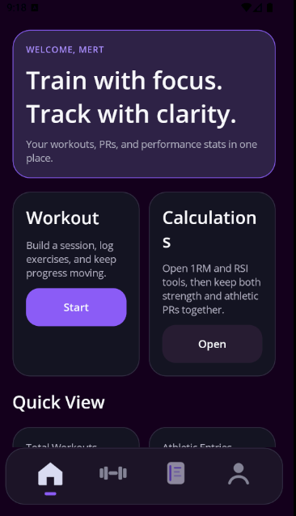

Workout landing screen for active programs, starter templates, session creation, and history access.

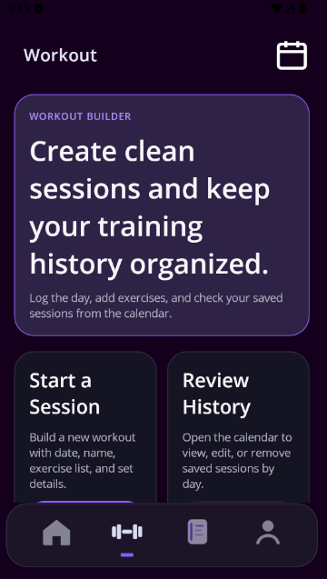

Calendar view with saved sessions and edit/delete actions.

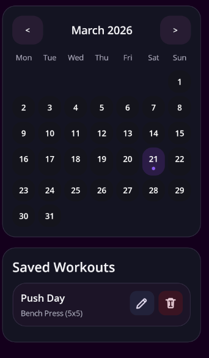

### Workout Flow

Session setup and workout detail entry.

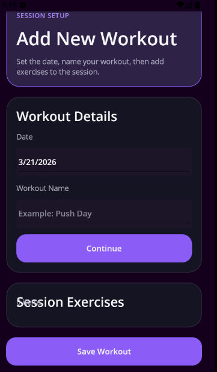

Exercise browser with Push category recommendations.

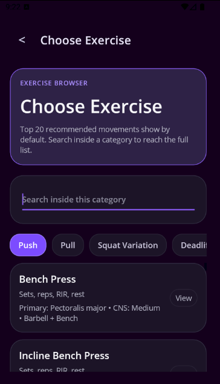

Squat variation recommendations in the browser.

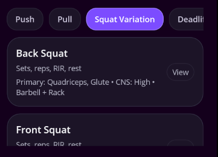

Jump-focused movement recommendations.

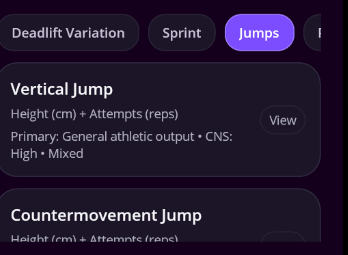

Olympic lift recommendations including Power Clean variations.

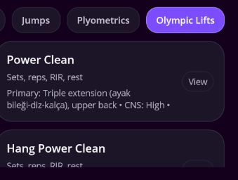

### Calculations

Strength estimate flow with movement selection and input capture.

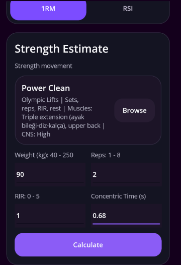

Calculated rep range output from the 1RM tool.

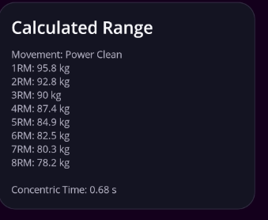

RSI calculation flow using jump height and GCT.

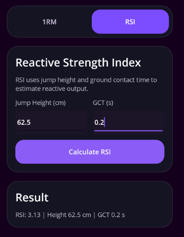

### Profile

Athletic performance logging with movement-based result tracking.

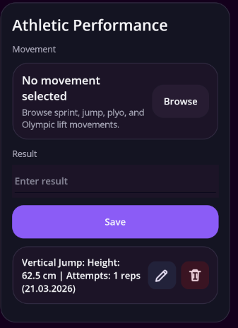

Movement goal creation tied to catalog movements.

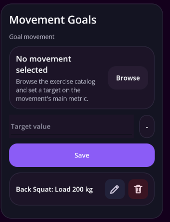

Profile details including body metrics and sport background.

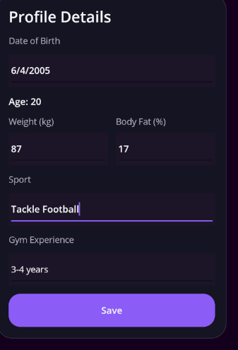

## Tech Stack & Tooling

- .NET MAUI
- C#
- ASP.NET Core Web API
- PostgreSQL
- Railway
- Google Gemini
- xUnit
- VS Code
- GenAI
  - Codex GPT-5.4 for coding
  - Opus 4.6 for prompting
  - GPT-5.4 Deep Research for ExerciseCatalog work
- Git for version control
- GitHub for tracking

## Quality

Automated testing now has multiple layers:
- `FreakLete.Core.Tests` covers core/unit logic such as calculations, parsing, catalog rules, and helper behavior
- `FreakLete.Api.Tests` covers auth, athlete profile, coach profile, workouts, PR entries, athletic performance, movement goals, exercise catalog, sport catalog, calculations, training programs, and FreakAI controller regression scenarios
- manual smoke testing remains a separate release-verification layer for end-to-end mobile flows

Current verification note for this documentation refresh:
- `FreakLete.Core.Tests` ran and passed `167/167`
- `FreakLete.Api.Tests` ran and passed `293/293`

That automated coverage provides strong confidence in backend and core logic when the suites are green. Real MAUI page behavior and user-facing flows are verified through manual Android emulator smoke testing, which is the documented release-verification path.

The production backend has also passed end-to-end smoke tests for auth, profile, workouts, PRs, athletic performance, movement goals, and account deletion.

## Google Play Release Readiness

### Completed

- Plugin.InAppBilling 10.0.0 + Google Play Billing Library 8.1.0 (PBL 8)
- Release AAB build: `bin/Release/net10.0-android/publish/com.mert.freaklete-Signed.aab`
- `android:allowBackup="false"` in manifest
- Release network config: HTTPS-only, no cleartext exceptions
- Debug network config: 10.0.2.2 cleartext preserved for emulator local backend
- Privacy policy draft: `docs/PRIVACY_POLICY.md`
- Account deletion doc (in-app + web path): `docs/ACCOUNT_DELETION.md`
- Play Data Safety worksheet: `docs/PLAY_DATA_SAFETY.md`
- Health Apps declaration worksheet: `docs/PLAY_HEALTH_APPS_DECLARATION.md`
- Play Console product setup checklist: `docs/PLAY_CONSOLE_SETUP.md`
- Production backend env checklist: `docs/PRODUCTION_BACKEND_CHECKLIST.md`
- Release smoke checklist updated with Phase 4 play/backend readiness gates: `docs/RELEASE_SMOKE_CHECKLIST.md`

### Still Required Before Submission

- **Host privacy policy** at a public URL (e.g., `https://freaklete.app/privacy`)
- **Publish account deletion web form** at `https://freaklete.app/account-deletion` — required by Google Play for apps with account creation
- **Fill Play Console Data Safety form** using `docs/PLAY_DATA_SAFETY.md` as reference
- **Complete Health Apps declaration** in Play Console using `docs/PLAY_HEALTH_APPS_DECLARATION.md` as reference
- Add medical disclaimer to Play Store long description (see `docs/PLAY_HEALTH_APPS_DECLARATION.md`)
- Add Privacy Policy link in app settings/profile once the hosted URL is live
- Configure release signing in Play Console (upload key / Play App Signing)
- **Create Play Console products** per `docs/PLAY_CONSOLE_SETUP.md`: `freaklete_premium` (subscription with `monthly`/`annual` base plans), `donate_1/5/10/20` (consumable)
- **Set Railway env vars** per `docs/PRODUCTION_BACKEND_CHECKLIST.md`: JWT, Gemini, GooglePlay service account
- Set version code and version name before first Play Store upload

## Roadmap

### Near-Term Shipped Reality Gaps

- iOS/Mac/Windows billing integration (Android-first billing is shipped)
- Custom donation amounts (only fixed $1/$5/$10/$20 SKUs shipped)
- RTDN / PubSub real-time billing notifications (sync-based approach shipped)
- iOS release preparation
- Dashboard-first UI V2 across Home, Workout, Calendar, Calculations, Profile, New Workout, and FreakAI
- Tracking analytics dashboards for PR, bodyweight, workout count, and consistency trends
- Live workout depth beyond v1, including guided per-set automation, richer fatigue signals, and deeper session analytics
- Benchmark-specific profile expansion such as `HeightCm`, `Sex`, and richer recommendation groundwork
- Deeper benchmark-aware FreakAI intelligence layer

### Performance Standards & Guidance

- Calculations intelligence: add lift-relative-strength displays, percentile-driven lift/jump tiers, and air-time-to-vertical-jump conversion without presenting any of them as already shipped.
- Profile level system: add `HeightCm` and `Sex`, limit v1 benchmarked movements to `Bench Press`, `Back Squat`, `Deadlift`, `Military/Overhead Press`, `Power Clean`, `Vertical Jump`, and `Single/Standing Broad Jump`, and use planned labels of `Beginner`, `Intermediate`, `Advanced`, and `Freak`.
- Composite identity and tooltips: only show labels such as `Athlete`, `Powerlifter`, or `Hybrid` when enough supporting data exists, and add small explainer tooltips for `1RM`, `RSI`, `FFMI`, and benchmark terms.
- Exercise demo media: start with optional demo metadata for Tier-1 movements only, while keeping `Instructions`, `CommonMistakes`, `Progression`, and `Regression` text as the fallback whenever media is absent.

## Author

- GitHub: https://github.com/MerttBodur
- LinkedIn: https://www.linkedin.com/in/mert-bodur-08a053285/
